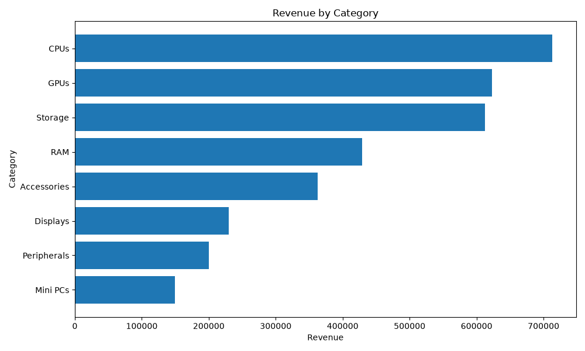
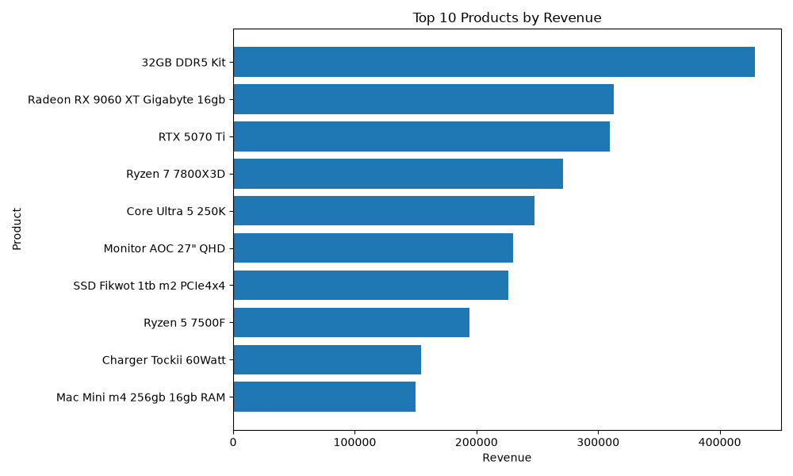
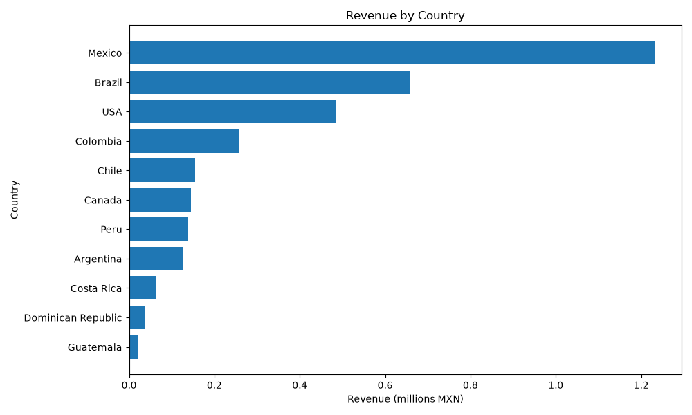
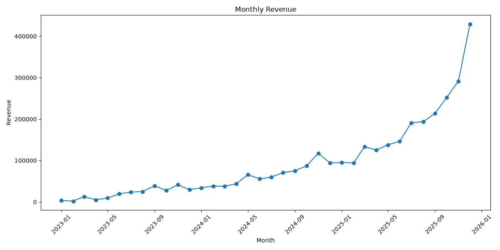

## Project Overview

This project simulates a small e-commerce dataset using Python, loads the generated data into PostgreSQL, and runs SQL-based analytics and data quality checks. The goal is to practice core data engineering skills such as data generation, relational modeling, database loading, validation, and documentation.

Includes a minimal PostgreSQL command-line helper supporting SQL execution, table listing, and table description commands.

## Data Quality Checks

This project includes SQL-based data quality checks using Python and PostgreSQL.

Current checks:

* Sales quantity must be greater than 0.
* Product price must be greater than 0.
* Every sale must reference an existing customer.
* Every sale must reference an existing product.
* Sale date cannot be earlier than customer registration date.
* Customer segment must belong to the allowed segment list.

The checks are executed with:

```bash
python quality_checks.py
```

## Dashboard Preview

The project includes simple chart outputs generated from the exported PostgreSQL analytics reports.

### Revenue by Category



### Top Products by Revenue



### Revenue by Country



### Monthly Revenue


